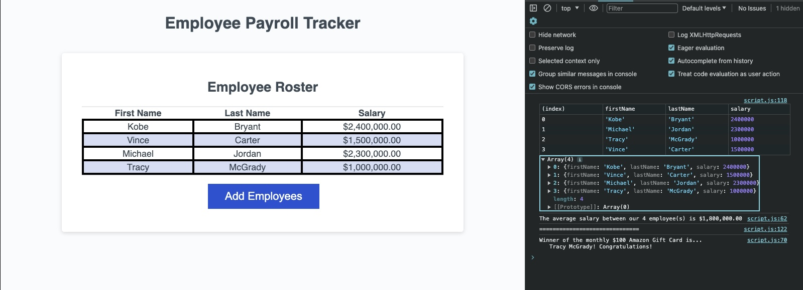

# Payroll-Tracker

[Deployed Link](https://imneeeks.github.io/Payroll-Tracker/)

## Description

This application creates a list of employees and their salaries.

## Additional Features

The console displays two additional functions: employee average salary and random winner of monthly giveaway.

## Usage

Follow prompts to add first name, last name, and salary of employee.

Please use numbers only on salary prompt. Using any special characters will cause number to default to "0" .

